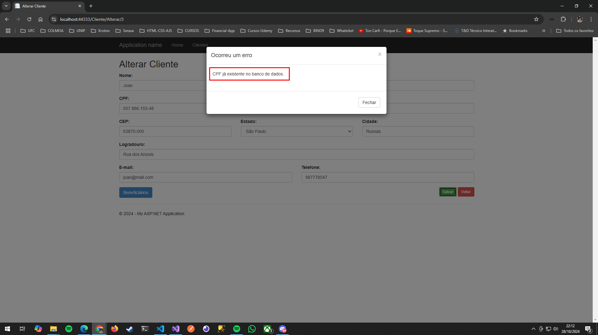
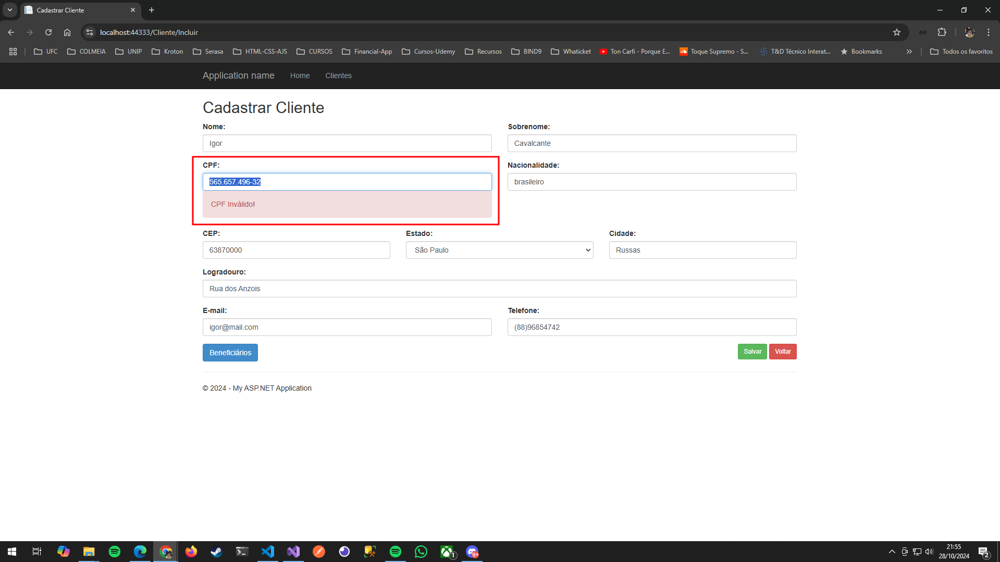
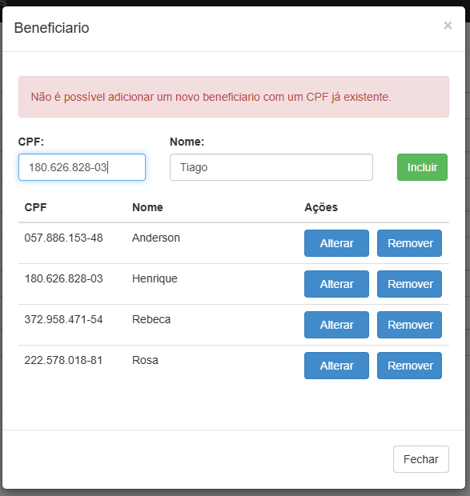
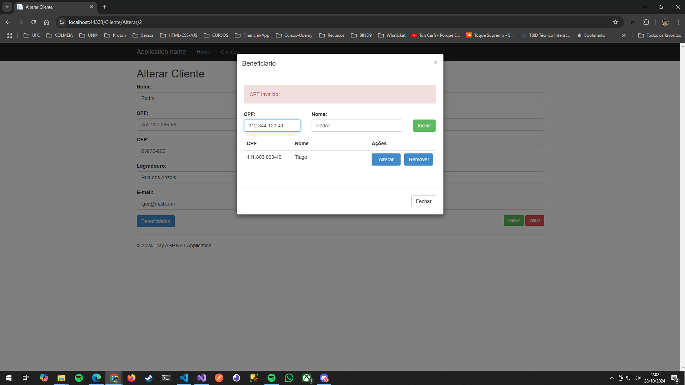

# ProjetoCadastro

## Visão geral

A atividade consiste em adicionar o campo de CPF ao formulário de cliente, formatação e validação.

Solicita também a adição de um modal para adição de Beneficiário com os campos Nome e CPF, onde é possível adicionar, alterar e remover.

## Features adicionadas

O formulário de cadastro/alteração de cliente não permite a adição de um CPF já existente no banco.

Ex.:

O campo de CPF possui as seguintes regras:

- Máscara para formatação do CPF tem o seguinte padrão (###.###.###-##)
- A validação do CPF é com base em algoritmo que valida o dígito verificador.

Ex.:

O modal de beneficiário possui algumas regras.

- Não é possível adicionar mais de um Beneficiário com o mesmo para um mesmo cliente.

Ex.:

- É possível adicionar, alterar e remover os beneficiários.

Ex.:

